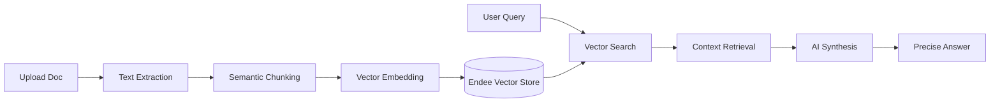

# DocuQuery 🧠📄

<div align="center">
  
  
  
</div>

<br />

**DocuQuery** is an advanced, AI-powered document intelligence platform. It transforms static documents into interactive knowledge bases using **Retrieval-Augmented Generation (RAG)** and high-performance semantic vector search.

---

## 🚀 Core Capabilities

- **🧠 Neural Synthesis**: Advanced LLM integration that reasons over your data to provide human-like answers.
- **⚡ Sub-millisecond Retrieval**: Powered by the **Endee Search Engine** for lightning-fast similarity matching.
- **🛡️ Privacy-First Indexing**: Documents are processed with secure local indexing logic.
- **📱 Fluid Responsiveness**: A sleek, glassmorphism-inspired interface optimized for mobile, tablet, and desktop.
- **📁 Multi-Format Ingestion**: Seamlessly process and index PDF and TXT files.

---

## 🛠️ The Intelligence Stack

### **Frontend**
- ⚛️ **React 19** - UI Component Architecture
- 🎨 **Tailwind CSS 4** - Utility-First Styling
- ✨ **Framer Motion** - Fluid Animations
- 🧩 **Lucide Icons** - Crisp SVG Iconography

### **Backend**
- 🟢 **Node.js / Express** - Server-Side Runtime
- 📂 **Multer** - File Upload Handling
- 📄 **PDF-Parse** - Document Extraction

### **AI & Vector Engine**
- 💎 **Google Gemini** - Embeddings & Synthesis
- ⚡ **Endee Vector DB** - High-Performance Retrieval

---

## 🧩 How It Works



---

## 🏁 Getting Started

### **1. Prerequisites**
- Node.js (v18+)
- A Google Gemini API Key

### **2. Installation**
```bash
# Clone the repository
git clone https://github.com/yashag1204/DocuQuery.git

# Navigate to the project directory
cd DocuQuery

# Install dependencies
npm install
```

### **3. Configuration**
Create a `.env` file in the root directory and add your Gemini API key:
```env
GEMINI_API_KEY=your_api_key_here
```

### **4. Run the Application**
```bash
# Start the development server
npm run dev
```
The app will be available at `http://localhost:3000`.

---

## 🔗 Project Links

- **🌐 Live Demo**: [DocuQuery App](https://ais-pre-s3wpduxrw4wlpndyycwuln-587604723575.asia-east1.run.app)
- **💻 Repository**: [https://github.com/yashag1204/DocuQuery](https://github.com/yashag1204/DocuQuery)
- **📦 Endee Official**: [https://github.com/endee-io/endee](https://github.com/endee-io/endee)
- **🏢 Company**: [Startologic](https://www.startologic.com/)

> **Note on Live Demo**: If the link doesn't show the app, ensure you have clicked the **"Share"** button in AI Studio to publish your build.

---

<div align="center">
  <p>Built with ❤️ for high-performance semantic search.</p>
  <p>© 2026 DocuQuery Intelligence</p>
</div>
