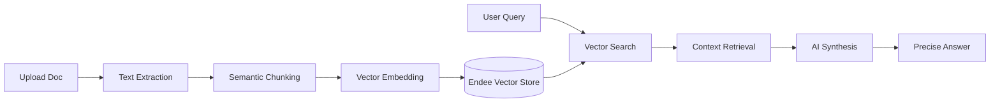

# DocuQuery 🧠📄

  
  
  

 

**DocuQuery** is an advanced, AI-powered document intelligence platform. It transforms static documents into interactive knowledge bases using **Retrieval-Augmented Generation (RAG)** and high-performance semantic vector search.

---

## 🚀 Core Capabilities

- **🧠 Neural Synthesis**: Advanced LLM integration that reasons over your data to provide human-like answers.
- **⚡ Sub-millisecond Retrieval**: Powered by the **Endee Search Engine** for lightning-fast similarity matching.
- **🛡️ Privacy-First Indexing**: Documents are processed with secure local indexing logic.
- **📱 Fluid Responsiveness**: A sleek, glassmorphism-inspired interface optimized for mobile, tablet, and desktop.
- **📁 Multi-Format Ingestion**: Seamlessly process and index PDF and TXT files.

---

## 🛠️ The Intelligence Stack

| Layer | Technology |
| :--- | :--- |
| **Frontend** | React 19, Tailwind CSS 4, Framer Motion |
| **Backend** | Express.js, Multer |
| **Vector Engine** | Endee Vector Database |
| **AI Models** | Google Gemini (Embeddings & Synthesis) |

---

## 🧩 How It Works

1. **Ingestion**: Documents are parsed and split into semantic segments.
2. **Embedding**: Each segment is converted into a 768-dimensional vector.
3. **Retrieval**: When you ask a question, we find the most relevant segments in real-time.
4. **Synthesis**: The AI uses the retrieved context to generate a factual, grounded response.

---

## 🔗 Project Links

- **🌐 Live Demo**: [DocuQuery App](https://ais-pre-s3wpduxrw4wlpndyycwuln-587604723575.asia-east1.run.app)
- **💻 Repository**: [https://github.com/yashag1204/DocuQuery](https://github.com/yashag1204/DocuQuery)
- **📦 Endee Official**: [https://github.com/endee-io/endee](https://github.com/endee-io/endee)
- **🏢 Company**: [Startologic](https://www.startologic.com/)

---

  
Built with ❤️ for high-performance semantic search.

  
© 2026 DocuQuery Intelligence

